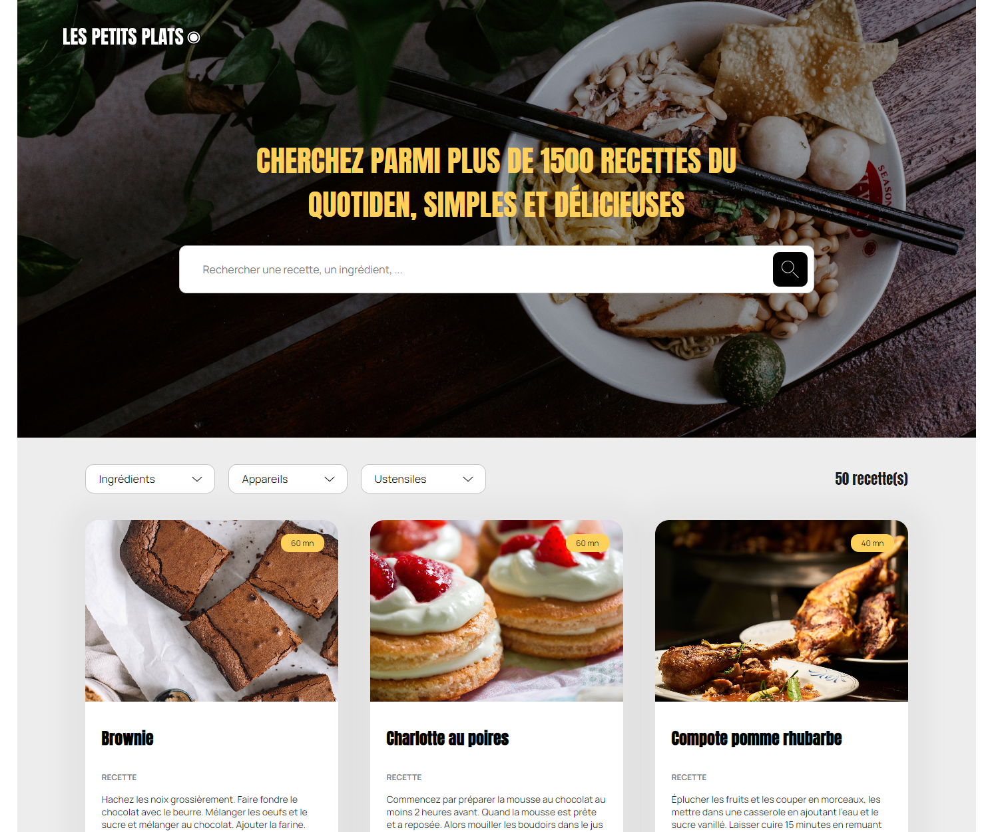

# Les petits plats


Développez un algorithme de recherche en JavaScript



## Description

Vous êtes freelance et vous venez d’être missionné par l’entreprise “Les petits plats” en temps que Développeur Front-end pour une mission de 3 mois.

## Installation

Allez dans un dossier de votre choix :

```
git clone https://github.com/code9g/les-petit-plats.git
```

Puis installez les dépendances :

```
npm install
```

Ouvrez directement la page "index.html" dans votre navigateur, ou via l'extension Live Server ou Show Preview de VS Code.

## Tester l'application

Vous n'êtes pas obligé d'installer cette application, vous pouvez tout simplement tester la recherche et les filtres [ici](https://code9g.github.io/les-petit-plats/)

[](<[http://](https://github.com/code9g/)>)
[](https://www.linkedin.com/in/pierre-andre-henry/)
